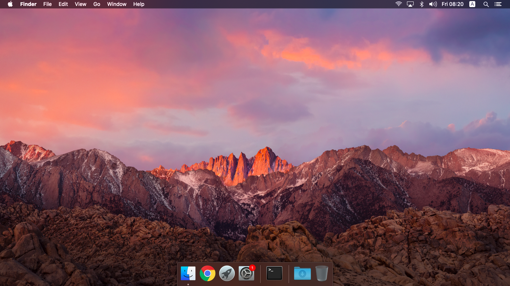
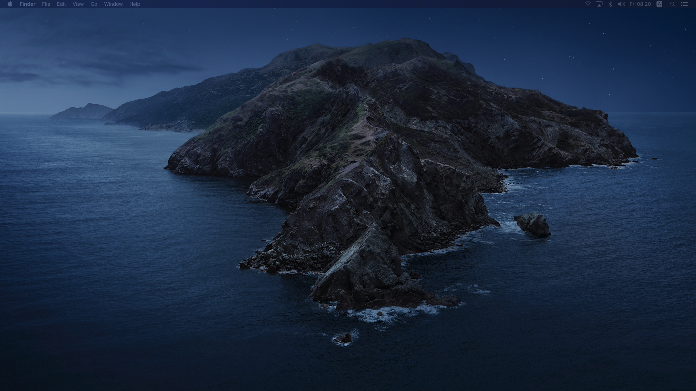

# Dell 5547 Catalina
A collection of all resources needed to run macOS Catalina or Big Sur on a Dell 5547

## 🔍 Overview
This is more of a compilation of information and configs from various repositories and forums than a place where real development happens. This repository should contain everything needed to get Catalina up and running on your specific Dell 5547 configuration.

## What works and what doesn't

| Feature | Status | Notes |
| ------------- | ------------- | ------------- |
| **Backlight Controls** | ✅ Working |  |
| **Battery** | ✅ Working |  |
| **imessage, app store, etc.** | ✅ Working |  |
| **All 3 usb ports** | ✅ Working |  |
| **Keyboard** | ✅ Working |  |
| **Trackpad** | ✅ Working |  |
| **Ethernet** | ✅ Working |  |
| **Webcam** | ✅ Working |  |
| **HDMI** | ✅ Working |  |
| **Graphics** | 🔶 Only Intel HD Graphics 4400 |  |
| **Amd r7 m265** | ❌ Not working |  |
| **Speakers and Headphones** | ✅ Working | To permanently fix headphones follow the instructions [here](#-audio) |
| **Wi-Fi/BT** | 🔶 Working, but not OOB | The stock Killer card must be replaced with a compatible one. See [here](#-wi-fibluetooth) |


### 🔈 Audio
By default, the audio can be a bit buggy. When using headphones, after some time the audio randomly stops. Sometimes un- and replugging the headphones works, but that's pretty annoying and unreliable. To permanently fix this issue you will have to install [ComboJack](https://github.com/hackintosh-stuff/ComboJack/tree/master/ComboJack_Installer) from the ```tools``` folder by running `install.sh`.

### 📶 Wi-Fi/Bluetooth
Iam using this USB WIFI https://www.tp-link.com/vn/home-networking/adapter/archer-t2u/.

### Shutdown/Sleep/Restart
This issues was fixed! Check the [**Management-Engine-Firmware**](https://github.com/anhbinhvodanh/Dell-5547-Hackintosh/tree/master/Management-Engine-Firmware) folder!
